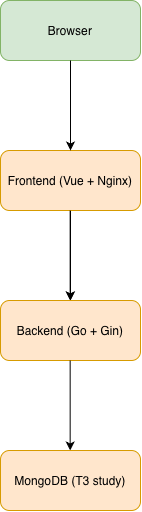
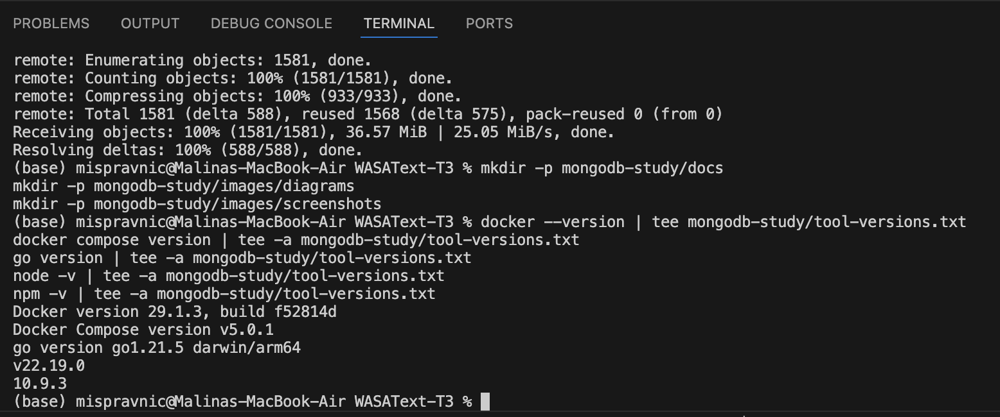
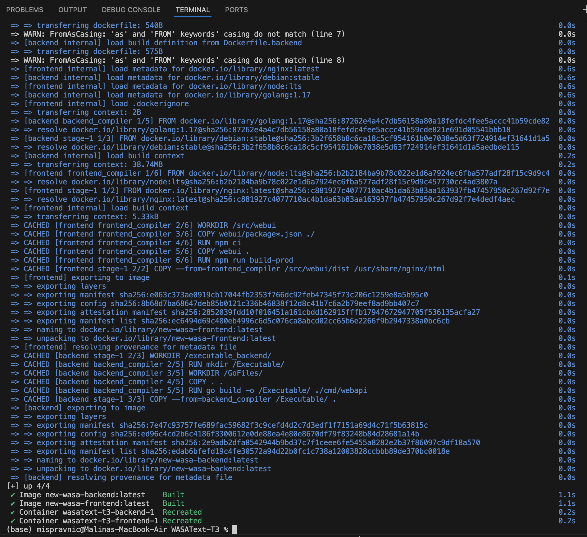
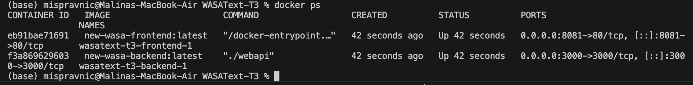

# Technical documentation — System architecture

## System overview
This project contains a web application (frontend + backend) and a MongoDB study used for the T3 deliverable (schema design strategies and scaling in MongoDB). The MongoDB work is isolated under `mongodb-study/`.

## Components
- **WebUI (Frontend)**: Vue 3 single-page application served via an Nginx container.
- **WebAPI (Backend)**: Go REST API service (Gin framework).
- **MongoDB (T3 study)**: A MongoDB container used to generate and benchmark a synthetic WASAText dataset.

## Runtime architecture (local)
The system runs locally using Docker containers. The frontend communicates with the backend via HTTP, and the backend communicates with MongoDB for the study dataset.

## Architecture diagram

**Figure 4.** High-level system architecture showing frontend, backend, and MongoDB components.
## Evidence of execution (screenshots)

### Tool versions

**Figure 1.** Tool versions collected from the local environment (Docker, Docker Compose, Go, Node, npm).

### Application startup

**Figure 2.** Building and starting frontend and backend services using Docker Compose.

**Figure 3.** Running application containers after startup.

## Software configuration
- **Frontend**: Vue 3 (see `webui/package.json`)
- **Backend**: Go + Gin (see `go.mod`)
- **Containers**: Docker Compose setup with separate frontend/backend containers

## Hardware configuration
macOS running on Apple Silicon laptop (local development machine).

## VM usage
No VM was used. All services were run locally via Docker containers.

## Related documentation
- Benchmarks and MongoDB explain outputs: [`benchmarks.md`](benchmarks.md)
- Data model (embedded vs referenced): `data-model.md`
