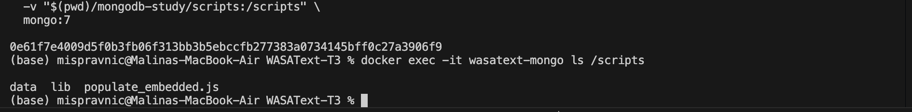
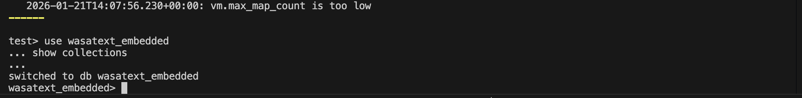
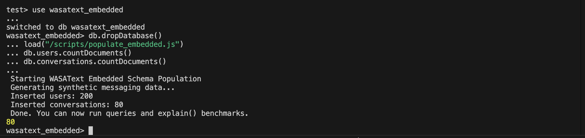
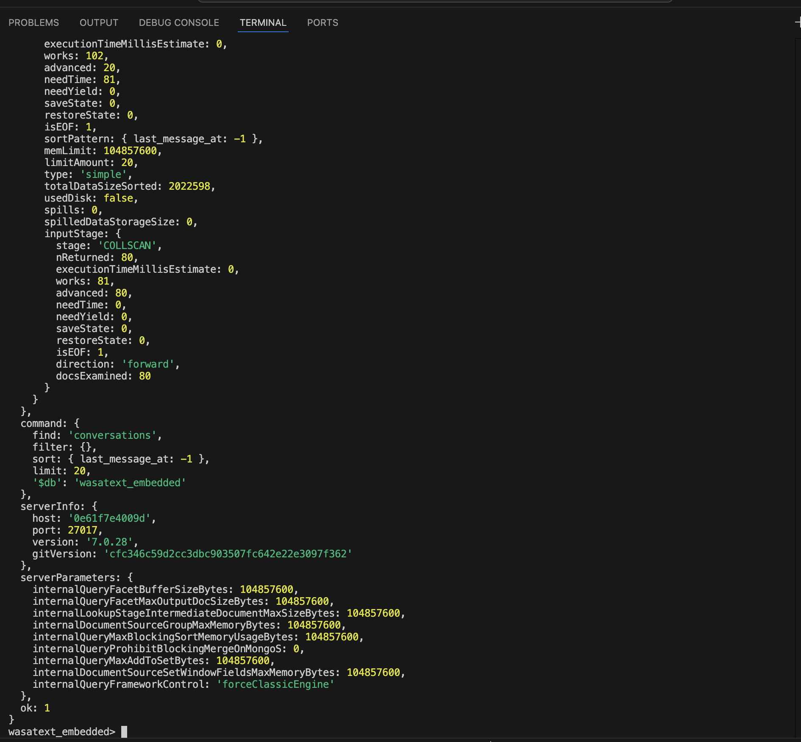
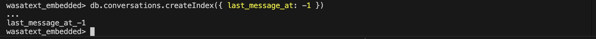
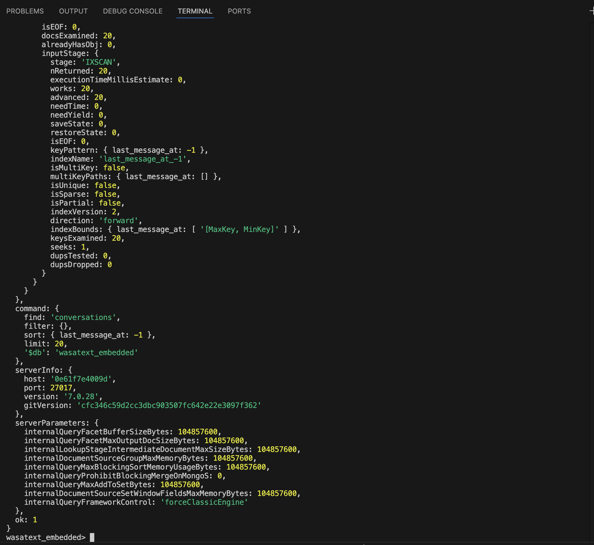

# Benchmarks & results

## Dataset setup (embedded schema)

### MongoDB container with mounted scripts


### Connected to database and collections


### Clean database and populate dataset


## Benchmark query

The following query retrieves the 20 most recently active conversations:

```js
db.conversations.find({}).sort({ last_message_at: -1 }).limit(20).explain("executionStats")
```

### Explain BEFORE index


### Create index on last_message_at


### Explain AFTER index


## Results table

| Scenario | Schema | Index | Plan (winning) | totalDocsExamined | totalKeysExamined | executionTimeMillis | Notes |
|---|---|---:|---|---:|---:|---:|---|
| Most recent conversations (`sort last_message_at desc`, `limit 20`) | Embedded | No | `COLLSCAN` + blocking `SORT` | 80 | 0 | 2 | Sort performed in memory (`usedDisk: false`) |
| Most recent conversations (`sort last_message_at desc`, `limit 20`) | Embedded | Yes (`last_message_at_-1`) | `IXSCAN` → `FETCH` → `LIMIT` | 20 | 20 | 0 | Index provides order; avoids blocking sort |

## Interpretation

- **Before indexing**, MongoDB scans the entire `conversations` collection (`COLLSCAN`, `totalDocsExamined = 80`) and then performs a **blocking in-memory sort** on `last_message_at` to return the top 20 results.
- **After creating the descending index** on `last_message_at`, the query switches to an **index scan** (`IXSCAN`) followed by `FETCH` and `LIMIT`. Because the index already stores documents in the needed order, MongoDB can return the first 20 entries directly, reducing work from scanning **80 docs** to **20 docs**.
- This benchmark demonstrates a typical messaging “recency feed” optimization: indexing the sort key reduces scanned documents and removes the blocking sort stage, improving latency and scalability as the dataset grows.
- `totalDocsExamined` decreased from **80** to **20** (4× fewer documents scanned).
