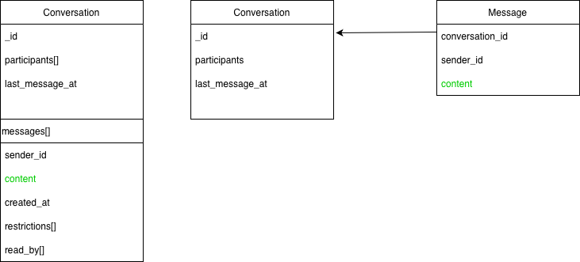

# Data model documentation — MongoDB schemas

## Overview
This section documents the data model used in the MongoDB study for the WASAText application. Two schema design strategies are considered:
- **Embedded schema**
- **Referenced schema**

The goal is to compare their structure and discuss trade-offs related to scalability, query performance, and data duplication.

---

## Embedded schema

In the embedded design, conversations embed related data (messages, reactions, receipts) directly inside the conversation document.

### Structure (simplified)
```json
{
  "_id": ObjectId,
  "participants": [ObjectId],
  "participants_count": Number,
  "last_message_at": Date,
  "messages": [
    {
      "_id": ObjectId,
      "sender_id": ObjectId,
      "content": String,
      "created_at": Date,
      "reactions": [
        { "emoji": String, "user_id": ObjectId }
      ],
      "read_by": [ObjectId]
    }
  ]
}
```

### Characteristics
- Messages are stored together with their parent conversation.
- Common read patterns (fetch conversation + recent messages) require a single document read.
- Risk of large document size as the number of messages grows.

### Advantages
- Fewer joins / lookups.
- Efficient for read-heavy workloads (e.g., chat overview).
- Simple query patterns.

### Disadvantages
- Document growth may approach MongoDB document size limits.
- Updates to deeply nested arrays can be costly.

---

## Referenced schema

In the referenced design, conversations and messages are stored in separate collections and linked via identifiers.

### Structure (simplified)

**Conversations collection**
```json
{
  "_id": ObjectId,
  "participants": [ObjectId],
  "participants_count": Number,
  "last_message_at": Date
}
```

**Messages collection**
```json
{
  "_id": ObjectId,
  "conversation_id": ObjectId,
  "sender_id": ObjectId,
  "content": String,
  "created_at": Date,
  "reactions": [
    { "emoji": String, "user_id": ObjectId }
  ],
  "read_by": [ObjectId]
}
```

### Characteristics
- Messages grow independently from conversations.
- Requires queries across collections (e.g., aggregation or multiple queries).
- Better suited for very large conversations.

### Advantages
- No risk of oversized documents.
- Better scalability for high-volume message histories.
- Flexible indexing strategies per collection.

### Disadvantages
- Requires joins (`$lookup`) or multiple queries.
- Slightly higher query complexity and latency.

---

## Data model diagram



**Figure X.** Comparison between embedded and referenced MongoDB schema designs.

## Comparison summary

| Aspect | Embedded schema | Referenced schema |
|---|---|---|
| Read performance | High (single document read) | Medium (joins or multiple queries) |
| Write scalability | Limited by document size | High |
| Schema simplicity | Simple | More complex |
| Risk of large documents | Yes | No |
| Suitable workload | Small–medium conversations | Large, long-lived conversations |

---


---

## Relation to benchmarks
The benchmark presented in `benchmarks.md` evaluates a common query pattern (fetch most recent conversations) on the embedded schema, highlighting the impact of indexing on `last_message_at`.
